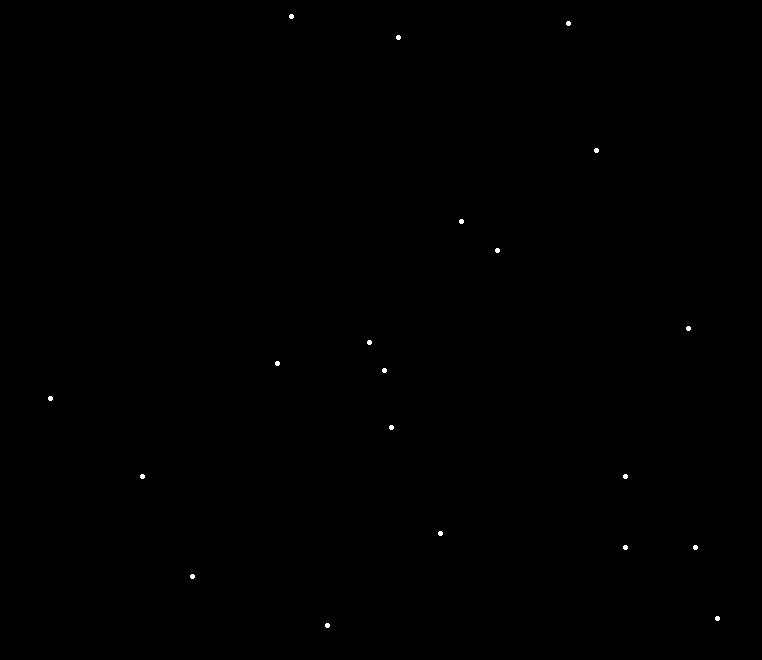
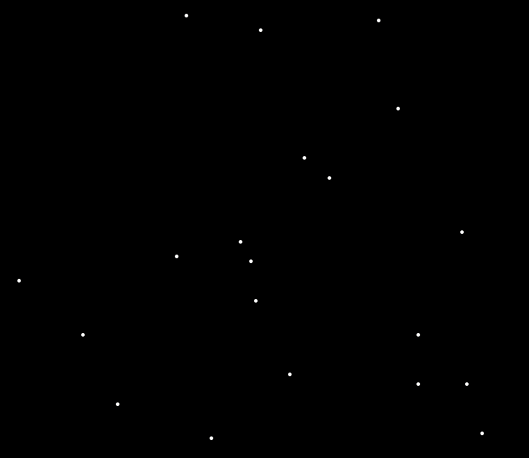
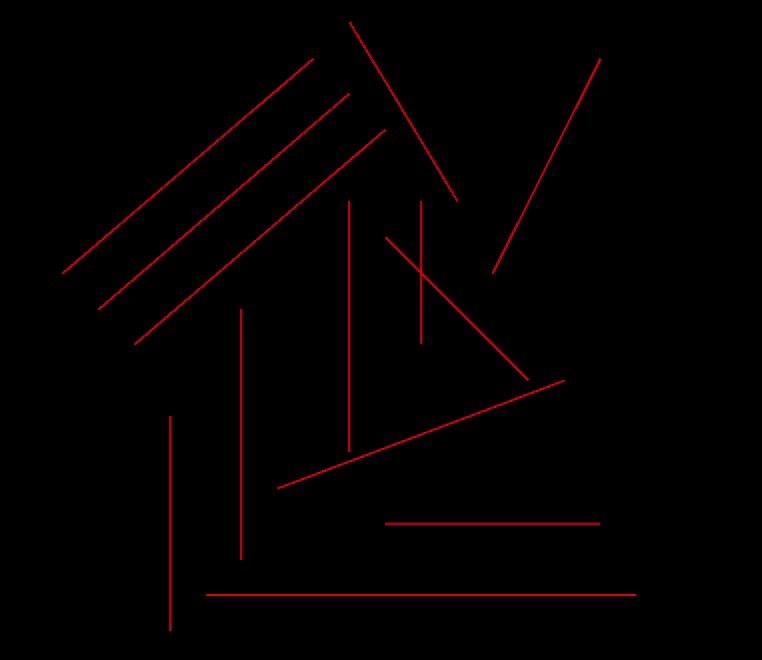
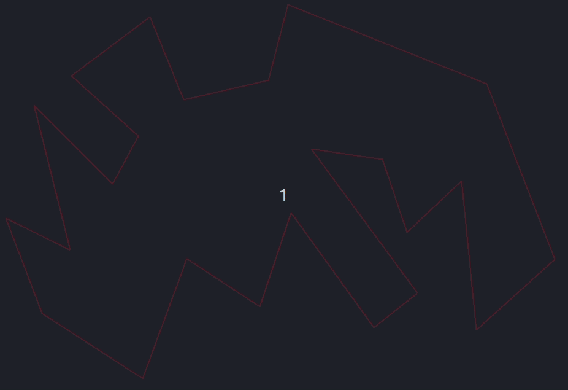
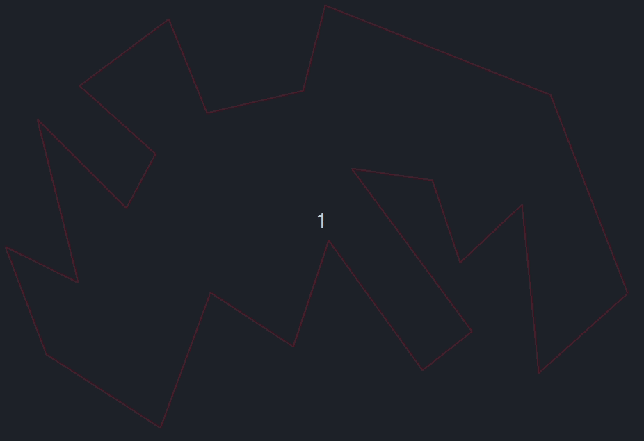
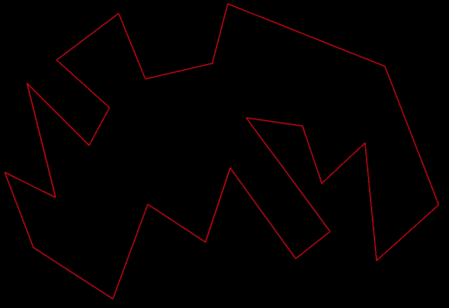
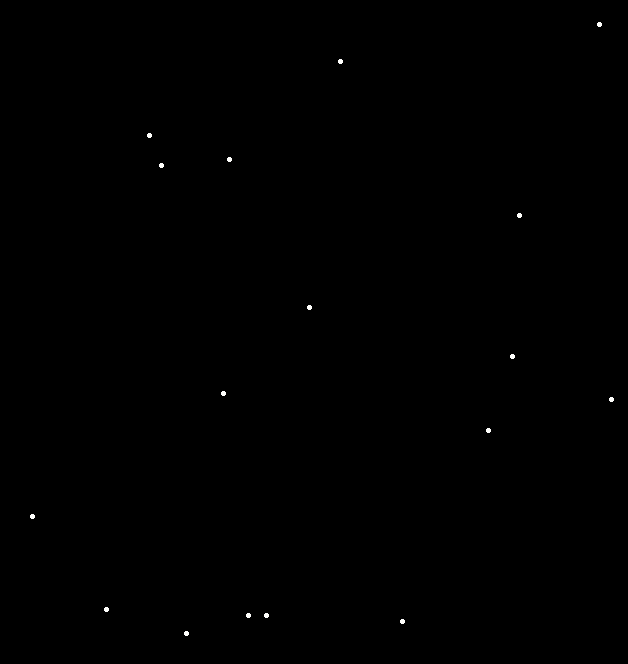

# Geometria Computacional

Algoritmos que visam resolver problemas geométricos em um plano 2D com a melhor eficiência possível. Foram baseados no texto que acompanhou o curso [Convite a Geometria Computacional](https://www.ime.usp.br/~cris/jai2009/), também foram utilizadas referências da matéria MAC0331 - Geometria Computacional.

Para melhor visualização dos algoritmos, foi utilizada a plataforma do Alexis Sakurai Landgraf, desenvolvida em um dos oferecimentos da disciplina MAC0331 - Geometria Computacional.

## Par de Pontos Mais Próximos

Dado um conjunto de n pontos, o algoritmo deve encontrar o par mais próximo. Este problema tem aplicações em controle de tráfego aéreo ou marítimo, onde pode-se querer saber quais são os objetos mais próximos para se detectar potenciais colisões.

### Algoritmo Elementar

Calcula todas as possíveis distâncias entre os pontos e armazena a menor calculada até o momento. Possui complexidade O(n²).

### Algoritmo de Shamos e Hoey

Divide o plano em dois, calcula recursivamente a menor distância em cada uma das duas partes, encontra a menor distância entre um ponto de uma parte e um da outra parte, e devolve a menor dentre estas três distâncias. Possui complexidade O(n log n).

## Fecho Convexo de um Conjunto de Pontos

Dado um conjunto de n pontos, o algoritmo deve encontrar o menor polígono convexo que cobre todos esses pontos. Uma aplicação deste problema se encontra em robótica, onde se deseja evitar que um robô em movimento colida com outros objetos.

### Algoritmo Incremental

Analisa um ponto de cada vez, incrementando o fecho convexo caso o ponto analisado não esteja incluído no fecho já existente. Possui complexidade O(n²).

### Algoritmo do Embrulho de Presente

Incrementa o fecho com o ponto mais extremo no sentido anti-horário, até retornar ao ponto inicial. Com isso, possui complexidade dependente do tamanho do fecho h: O(hn).

### Algoritmo de Graham

Semelhante ao algoritmo incremental, mas realiza uma ordenação angular em torno do ponto de menor coordenada y, de forma que um novo ponto sempre é adicionado substituindo os mais recentes, aumentando a eficiência. Possui complexidade O(n log n).

## Interseção de Segmentos

Dada uma coleção de n segmentos no plano, o algoritmo deve decidir se existem dois segmentos que se intersectam. Tem várias aplicações, como o ray tracing, que na computação gráfica é um método importante para o processamento digital de cenas.

### Algoritmo Elementar

Testa se há interseção entre todos os possíveis pares de segmentos da coleção. Possui complexidade O(n²).

### Algoritmo de Shamos e Hoey

Utiliza uma linha de varredura que percorre o plano da esquerda para a direita, de forma que se torna necessário somente testar as interseções em segmentos que tocaram a linha em sequência. Possui complexidade O(n log n).

## Triangulação de Polígonos

Dado um polígono formado por n vértices, o algoritmo deve encontrar um conjunto de diagonais que particiona o polígono. Sendo que uma diagonal é um segmento que se encontra completamente no interior do polígono, ligando dois vértices não consecutivos. Pode ser aplicada na simplificação de modelos 3D, reduzindo o tempo de processamento em renderizações.

### Algoritmo N4

Encontra uma diagonal utilizando força bruta e repete o processo recursivamente nos polígonos de cada lado da diagonal até restarem somente triângulos. Possui complexidade O(n⁴).

### Algoritmo N3

Um vértice do polígono é ponta de orelha se o segmento entre seus vizinhos na fronteira do polígono forma uma diagonal. Percorre ciclicamente os vertices adjacentes no polígono em busca de pontas de orelha, quando encontra alguma, ela é fechada com uma diagonal e o vértice é removido do polígono remanescente, até que só sobre um triângulo. Possui complexidade O(n³).

### Algoritmo N2

Semelhante ao algoritmo N3, mas utiliza uma lista ligada para armazenar os vértices e marca as pontas de orelha já no início do algoritmo e, ao remover uma ponta de orelha, recalcula se seus vizinhos passaram a ser pontas de orelha, reduzindo a complexidade total para O(n²).

### Triangulação de Polígonos Monótonos

Um polígono é monótono em relação a uma reta L se a interseção do polígono com qualquer reta perpendicular a L é conexa. Se L é o eixo y, dizemos que o polígono é y-monótono. O algoritmo funciona realizando a divisão em polígonos y-monótonos e depois triangulando cada um deles, atingindo uma complexidade O(n log n).

## Diagrama de Voronoi

Dado um conjunto de n pontos, o Diagrama de Voronoi é uma partição do plano em células, de forma que cada região é associada a um dos pontos dados p e definida pelo conjunto de pontos os quais a distância ao ponto p é menor que a distância aos outros pontos dados. Tem diversas aplicações, visto que é um padrão que ocorre muito na natureza, como em polímeros e no crescimento de florestas. Além de ser útil na robótica, para encontrar rotas com menor risco de colisão.

### Algoritmo de Fortune

Utiliza uma linha de varredura que percorre o plano de cima para baixo e um conjunto de curvas chamado de linha de praia, definido pelas parábolas equidistantes da linha de varredura e dos pontos cujas regiões ainda estão sendo formadas. Possui uma fila de prioridade com dois tipos de eventos, um evento-ponto que ocorre ao encontrar um dos pontos dados e adiciona um arco na linha de praia, e um evento-círculo, que ocorre quando um arco some da linha de praia e indica um vértice do diagrama de Voronoi. Possui complexidade O(n log n).

## Como Executar

Para executar as simulações, rode o comando `python3 tkgeocomp.py` no terminal. Uma interface gráfica será aberta, onde você poderá escolher o conjunto de dados e o algoritmo que será executado. Para mais detalhes, veja o [README da plataforma](src/README.md).
